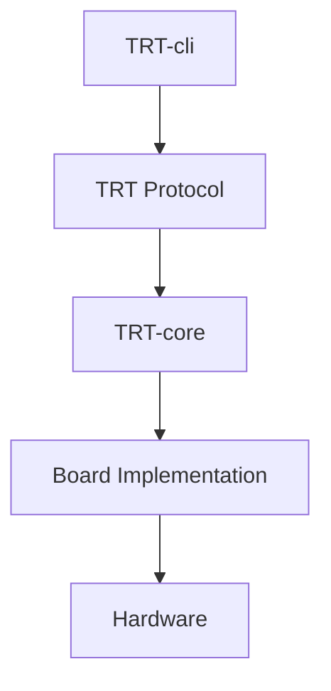
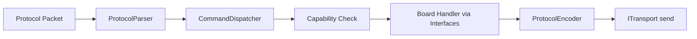

# TRT-core Architecture

## Layer Diagram

## Runtime Data Flow

## Core Architectural Rules

1. TRT-core must depend only on abstract interfaces for board resources.
2. Board families own concrete hardware access implementations.
3. Dispatcher logic must remain board-agnostic.
4. Capability checks are runtime and board-provided.
5. Transport and protocol layers are decoupled.

## Board Architecture

`BoardContext` is the runtime composition root. It aggregates:

- `BoardInfo`
- `CapabilityManager`
- `ModuleManager`
- `ITransport`
- Interface bindings (`IGpio`, `IPwm`, `IAdc`, `IDac`, `II2c`, `ISpi`, ...)

Board startup flow:

1. Construct board implementations for required interfaces.
2. Register supported capabilities.
3. Register modules.
4. Inject transport implementation.
5. Build `BoardContext` and pass into dispatcher flow.

## Transport Architecture

`ITransport` defines a transport-neutral contract:

- `connect()`
- `disconnect()`
- `send()`
- `receive()`

Protocol logic works only with bytes and does not know whether runtime uses USB CDC, UART, CAN FD, TCP/IP, or simulator transport.

## Module Architecture

`IModule` and `ModuleDescriptor` define module metadata and discoverability:

- Module type
- Module revision
- Module name
- Module capability list

`ModuleManager` stores registered modules and exposes module inventory to command handlers and higher-level runtime services.

## Debug Strategy (Planned)

Planned CLI flags map into runtime log levels:

- `-d`: general execution
- `-dd`: TX packet
- `-ddd`: TX + decoded packet
- `-dddd`: TX + RX + decoded analysis

This repository documents the model but does not implement debug output behavior yet.
