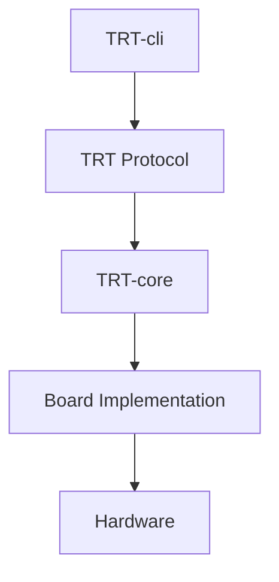
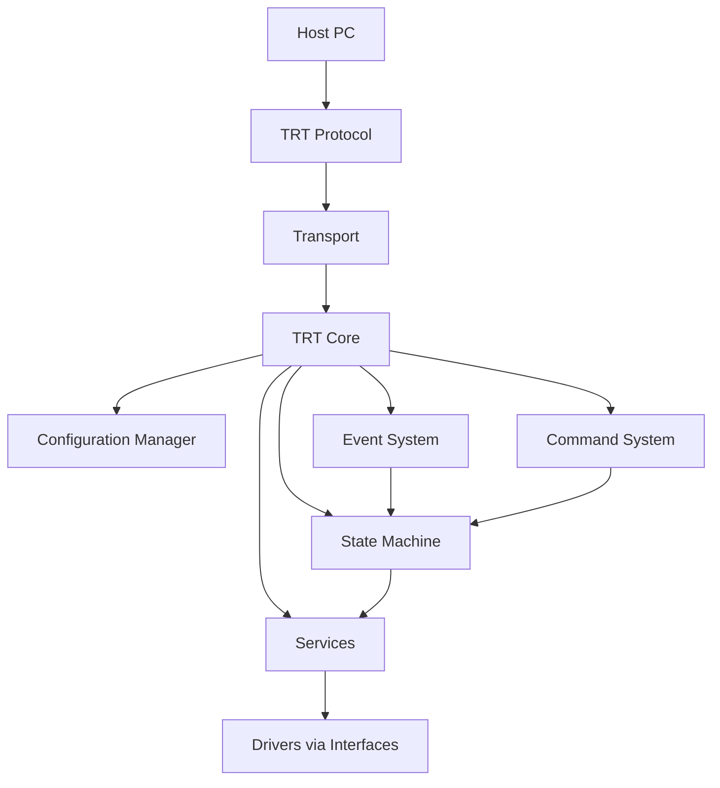
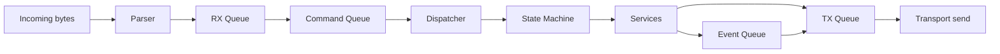

# TRT-core Architecture

## Layer Diagram

## Runtime Architecture

## Queue-Centric Data Flow

## Architectural Rules

1. TRT-core depends on interfaces, never concrete board drivers.
2. Runtime must remain non-blocking and autonomous.
3. Commands request intent and state changes, not direct hardware actions.
4. Services and state machine remain operational without host connection.
5. Protocol and transport are decoupled by parser/encoder and ITransport contracts.
6. Configuration Manager is the single source of runtime policy.
7. Capabilities are declared by board integration and checked at runtime.
8. Every board must implement the mandatory TRT Protocol V0.1 command set and identifiers.

## BoardContext Role

BoardContext is the runtime composition root and service locator for core execution layers.

It aggregates:

1. BoardInfo
2. CapabilityManager
3. ModuleManager
4. ITransport
5. Interface bindings (IGpio, IPwm, IAdc, IDac, II2c, ISpi, and optional interfaces)

Startup composition sequence:

1. Construct interface implementations.
2. Register capabilities.
3. Register modules.
4. Bind transport implementation.
5. Initialize configuration services.
6. Start execution loop.

## Command and Event Separation

Commands:

- Direction: Host -> Board
- Path: Parser -> RX Queue -> Command Queue -> Dispatcher -> State Machine -> Service

Events:

- Direction: Board -> Host
- Path: Service/State -> Event Queue -> TX Queue -> Transport

This separation avoids host polling ownership and preserves autonomous runtime behavior.

Mandatory command set definition is maintained in docs/commands-v0.1.md.
Wire-format and identifier authority is maintained in docs/protocol.md.

## Transport Architecture

ITransport remains transport-agnostic with these responsibilities:

1. send()
2. receive()
3. connect()
4. disconnect()

Future adapters may target USB CDC, UART, CAN FD, TCP/IP, and simulator loopback while preserving identical core contracts.

## Module Architecture

IModule and ModuleDescriptor define module metadata:

1. Module type
2. Module revision
3. Module name
4. Capability list

ModuleManager exposes module inventory to services and state logic.

## Debug Architecture (Planned)

Future debug levels:

1. -d: general execution flow
2. -dd: transmitted packets
3. -ddd: transmitted packets and decoded commands
4. -dddd: TX/RX packets, decoded packets, state transitions, events, queue activity

The levels are architectural commitments documented here and implemented in future milestones.

