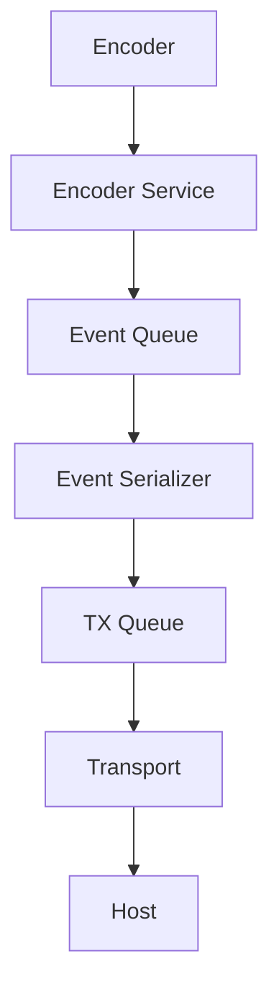

# TRT-core Event System

## Purpose

The event system is the board-to-host and board-internal signaling mechanism that enables autonomous behavior without polling-driven control loops.

## Event Flow

## Event Sources

1. Human input services (encoder, button).
2. State transitions.
3. Module lifecycle changes.
4. Warning and fault monitors.
5. Internal operation milestones.

## Event Queue Behavior

1. Events are enqueued immediately when produced.
2. Event consumers process items in bounded batches.
3. Serialization to protocol packet occurs before TX queue placement.
4. Overflow strategy must prioritize runtime safety and observability.

## Host Relationship

The host receives events as asynchronous updates. Host polling is not required for normal board behavior.

Events communicate what already happened on the board. They do not grant host ownership of board decisions.

## Example Event Sequence

1. User rotates encoder clockwise.
2. Encoder service emits ENCODER_CW.
3. State machine may update internal value and LED effect.
4. Event packet is queued and transmitted.
5. Host receives event and updates UI or logs.
