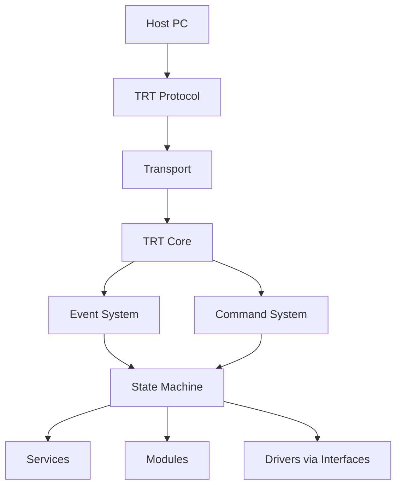

# TRT-core Execution Model

## Purpose

This document defines the runtime execution model that every TRT-compatible board must follow.

The design goal is board autonomy with non-blocking communication. The board continues its internal behavior with or without a host connection.

## Runtime Topology



## Non-Blocking Principle

The following architecture is forbidden:

```cpp
while (1) {
    wait_for_message();
}
```

It blocks firmware progression, prevents autonomous behavior, and makes the board dependent on host traffic.

TRT-core requires a cooperative, non-blocking main loop:

```cpp
while (1) {
    update_services();
    process_events();
    process_commands();
    update_state_machine();
    transmit_pending_messages();
}
```

Why this model is preferred:

1. Board behavior continues when no host is connected.
2. Inputs such as encoder and button are processed in real time.
3. Commands are integrated into runtime instead of controlling runtime.
4. Events are generated and buffered without polling pressure from host.
5. Same architecture works on bare-metal MCUs and simulator targets.

## Queue-Based Runtime

TRT-core uses internal queues to decouple producers from consumers and avoid blocking.

### RX Queue

- Stores decoded incoming protocol packets.
- Producer: transport + parser pipeline.
- Consumer: command ingestion stage.

### Command Queue

- Stores commands accepted for execution.
- Producer: command ingestion stage.
- Consumer: command dispatcher and command handlers.

### Event Queue

- Stores board-generated events.
- Producer: services, modules, state machine transitions.
- Consumer: event serializer and TX stage.
- Example events: ENCODER_CW, ENCODER_CCW, BUTTON_CLICK, BUTTON_LONG_PRESS.

### TX Queue

- Stores response and event packets waiting for transmit.
- Producer: command response stage and event serialization stage.
- Consumer: transport transmitter.

## Main Loop Scheduling Guidance

Each loop iteration should:

1. Advance time-driven and input-driven services.
2. Drain a bounded number of event items.
3. Drain a bounded number of command items.
4. Evaluate and apply state transitions.
5. Drain a bounded number of TX packets.

Bounded draining prevents starvation and keeps latency predictable.

## Threading Model

The baseline model is single-thread cooperative execution. The architecture remains valid when a platform later maps parts to RTOS tasks.

If RTOS is used, queues become synchronization boundaries between tasks. Contracts and message ownership remain the same.

## Failure Handling Model

Queue overflow, malformed packets, unsupported capabilities, and transport failures must be handled as recoverable runtime conditions.

The board should keep running and continue local services even when communication is degraded.

## Portability Outcome

This execution model enables STM32, ESP32, Arduino, RP2040, Raspberry Pi class integrations, and simulator targets to share most runtime code while replacing only platform adapters.
