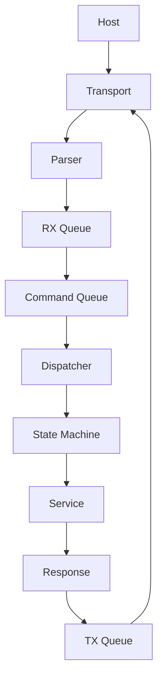
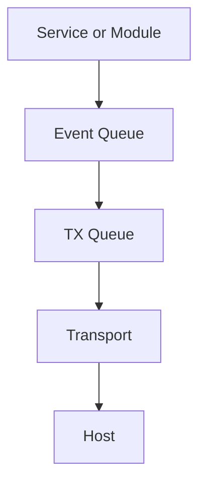

# Host Communication Model

## Purpose

This document defines the strict separation between host-issued commands and board-generated events.

## Directional Model

### Commands

- Direction: Host -> Board
- Purpose: request state/action intent
- V0.1 mandatory commands: PING, BOARD_VERSION, FW_VERSION, INFO, STATUS, CAPABILITIES

### Events

- Direction: Board -> Host
- Purpose: report observed runtime facts and transitions
- Examples: ENCODER_ROTATED, BUTTON_CLICKED, TEMPERATURE_WARNING

## Design Rule

Host communication is a communication layer, not an execution owner.

Board runtime remains autonomous and continues operating when host link is unavailable.

V0.1 commands are designed for discovery and observability, not hardware control.

## Command Flow

Commands must not directly manipulate hardware behavior. State machine policy determines resulting outputs.

## Event Flow

## Capability-Driven Responses

Boards declare capabilities at startup. Generic commands are evaluated against declared capabilities.

If a capability is unavailable, runtime returns ERROR_UNSUPPORTED_COMMAND.

The CLI should not apply board-specific command filtering logic.

## V0.1 Compatibility Baseline

All TRT-compatible boards must implement these commands:

1. PING
2. BOARD_VERSION
3. FW_VERSION
4. INFO
5. STATUS
6. CAPABILITIES

If any command in this set is not supported, the board is not TRT-compatible for V0.1.

